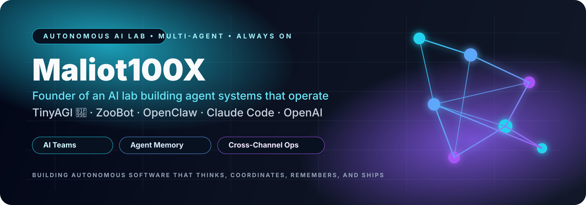

  

<h1 align="center">Maliot100X</h1>

  <strong>Founder of an autonomous AI lab building multi-agent systems, digital operators, and 24/7 execution infrastructure.</strong>

  
  
  
  
  
  

  
  
  
  
  

---

## ⚔️ Founder / AI Lab Direction

I’m building an **AI lab in public**.

Not just chatbots. Not just random demos. Not just one-off repos.

I’m building a connected ecosystem of:
- **multi-agent systems**
- **AI operator workflows**
- **always-on assistants**
- **memory-driven runtimes**
- **cross-channel automations**
- **GitHub-native execution systems**

The goal is bigger than a single project.
The goal is to create autonomous software that can **think, coordinate, remember, and ship**.

---

## 🧠 The Thesis

> The next generation of software won’t be static.
> It will be agentic, collaborative, persistent, and operational.

That is what this profile is about.

### What defines the ecosystem
- **Multi-agent by design** — teams of specialized AI workers
- **Multi-team by architecture** — systems that split roles, not just prompts
- **Multi-channel by deployment** — GitHub, web, bots, dashboards, messaging
- **24/7 by intention** — always-on digital operators
- **Ship-first culture** — build fast, publish publicly, improve continuously

---

## 🚀 Flagship Projects

### [ZooBot](https://github.com/Maliot100X/ZooBot)
**Open Source AI Agent Framework with Free LLM Support (Groq, OpenAI-compatible)**

The clearest public signal of the direction I’m pushing:
open AI infrastructure, agent orchestration, practical operator workflows, and systems designed to do more than just respond.

**Highlights**
- TypeScript-based
- agent-oriented architecture
- aligned with OpenClaw and autonomous workflows
- public homepage available
- strongest current flagship for the ecosystem

---

### [openclaw.ai](https://github.com/Maliot100X/openclaw.ai)
A project tied directly to the OpenClaw identity and the broader vision of operational AI systems.

### [ClaudeCode](https://github.com/Maliot100X/ClaudeCode)
Part of the coding-agent workflow layer — where AI stops being theoretical and starts writing, iterating, and shipping.

### [AgentsCoinLaunchers](https://github.com/Maliot100X/AgentsCoinLaunchers)
A launch-focused project built with speed, energy, experimentation, and deployment in mind.

### [kai-nova-the-twin-sisters](https://github.com/Maliot100X/kai-nova-the-twin-sisters)
A branded autonomous concept project inside a larger AI universe — identity, story, and experimentation working together.

### [HybridClawMolt](https://github.com/Maliot100X/HybridClawMolt)
A multi-bot / unified assistant concept that fits directly into the idea of coordinated AI operators.

---

## 🔥 Spotlight Build

### [ZooBot](https://github.com/Maliot100X/ZooBot)
**Current featured build**

**Description:** Open Source AI Agent Framework with Free LLM Support (Groq, OpenAI-compatible)  
**Stack:** TypeScript  
**Topics:** `ai` `ai-agents` `claude` `openclaw` `zoobot`  
**Homepage:** https://zoobot-office-maliot.zocomputer.io/

Why this repo matters:
- it best captures the current public identity of the account
- it maps directly to multi-agent execution
- it feels like infrastructure, not just a toy
- it anchors the profile in something credible and scalable

---

## 🛠 Stack

### AI / Agent Runtime

  
  
  
  
  
  
  

### Build / Product Stack

  
  
  
  
  
  
  

---

## 🌌 Ecosystem Themes

This account keeps returning to the same deeper patterns:
- AI agents
- OpenClaw tooling
- coding-agent workflows
- autonomous assistants
- launch systems
- dashboards and control surfaces
- memory and orchestration
- branded AI worlds
- public building in real time

This is an **AI lab profile**, not a résumé.
It’s supposed to feel alive.

---

## 📡 Live Signals

  
  

  

  

---

## 🐍 Contribution Snake

  

---

## 🤝 Collaboration

I’m especially interested in people building:
- serious AI agent systems
- OpenClaw ecosystems
- Claude Code workflows
- OpenAI-powered tooling
- autonomous operators
- GitHub-first product systems
- launchable AI tools and SaaS

If you’re building the future of agentic software, I’m interested.

---

## 🔗 Connect

- **GitHub:** https://github.com/Maliot100X
- **X / Twitter:** https://x.com/KaiNovasWarm

---

## 🦞 Final Word

I’m not here to make AI look cute.
I’m here to make it useful, operational, scalable, and impossible to ignore.

This GitHub is where that gets built in public.

  <strong>Building the autonomous AI lab in public.</strong>

